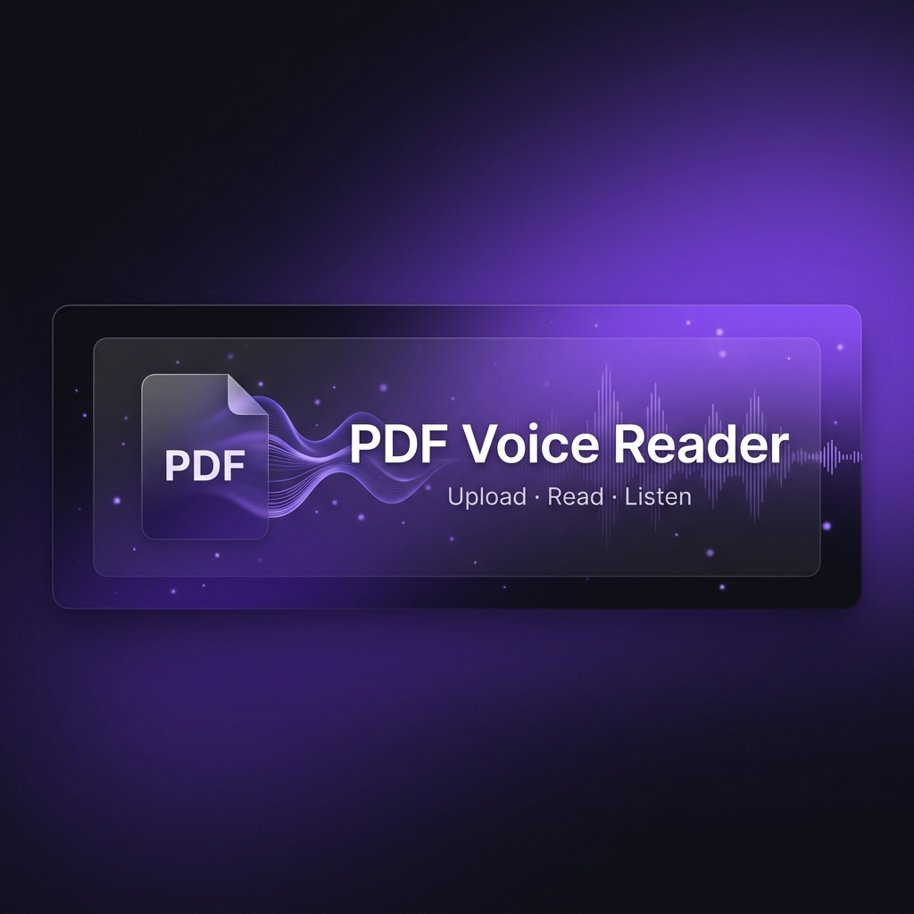

<p align="center">
  
</p>

<h1 align="center">📄 PDF Voice Reader</h1>

<p align="center">
  <strong>Transform any PDF into an immersive audio experience — upload, read, and listen instantly.</strong>
</p>

<p align="center">
  <a href="#features"></a>
  <a href="#tech-stack"></a>
  <a href="#getting-started"></a>
  <a href="#contributing"></a>
</p>

<p align="center">
  
  
  
  
  
</p>

---

## 📸 Preview

<p align="center">
  
</p>

<p align="center"><em>A sleek two-pane dashboard: PDF viewer on the left, smart controls on the right.</em></p>

---

## ✨ Features

<table>
  <tr>
    <td width="50%">

### 🎯 Core
- **📤 Drag & Drop Upload** — Instantly load any PDF file
- **📖 Pixel-Perfect Rendering** — Powered by `react-pdf` with full text layer support
- **🔊 Text-to-Speech** — Browser-native speech synthesis with no external APIs
- **🇮🇳 Indian Language Voices** — Auto-detects Hindi, Tamil, Telugu & more

</td>
    <td width="50%">

### ⚡ Controls
- **⏯️ Play / Pause / Stop** — Full playback lifecycle management
- **🎚️ Speed Control** — Adjustable from 0.5× to 2.0× in real-time
- **🔍 Zoom In/Out** — Scale from 50% to 300% for comfortable reading
- **📝 Text Selection** — Highlight any section and speak just that part

</td>
  </tr>
  <tr>
    <td width="50%">

### 🎨 Design
- **🌙 Dark Mode UI** — Beautiful deep-purple dark theme
- **💎 Glassmorphism** — Modern card-based sidebar layout
- **✨ Micro-Animations** — Smooth hover effects & transitions
- **📱 Responsive** — Works across desktop screen sizes

</td>
    <td width="50%">

### 📚 Productivity
- **🔖 Bookmarks** — Save important text selections for later
- **🔁 Live Voice Switching** — Change voices mid-playback seamlessly
- **📄 Multi-Page Support** — All pages render in a scrollable view
- **🧹 Auto Cleanup** — Uploaded files are deleted after processing

</td>
  </tr>
</table>

---

## 🛠 Tech Stack

<table>
  <tr>
    <th align="center">Layer</th>
    <th align="center">Technology</th>
    <th align="center">Purpose</th>
  </tr>
  <tr>
    <td align="center">⚛️ Frontend</td>
    <td><strong>React 19</strong></td>
    <td>Modern UI with hooks-based state management</td>
  </tr>
  <tr>
    <td align="center">🎨 Icons</td>
    <td><strong>Lucide React</strong></td>
    <td>Beautiful, consistent iconography</td>
  </tr>
  <tr>
    <td align="center">📄 PDF</td>
    <td><strong>react-pdf + PDF.js</strong></td>
    <td>High-fidelity PDF rendering with text layers</td>
  </tr>
  <tr>
    <td align="center">🔊 Speech</td>
    <td><strong>Web Speech API</strong></td>
    <td>Native browser text-to-speech engine</td>
  </tr>
  <tr>
    <td align="center">🌐 HTTP</td>
    <td><strong>Axios</strong></td>
    <td>Promise-based HTTP client for API calls</td>
  </tr>
  <tr>
    <td align="center">🖥️ Backend</td>
    <td><strong>Express 5</strong></td>
    <td>Fast, minimal Node.js web framework</td>
  </tr>
  <tr>
    <td align="center">📦 Upload</td>
    <td><strong>Multer</strong></td>
    <td>Multipart form-data handling for file uploads</td>
  </tr>
  <tr>
    <td align="center">📑 Parser</td>
    <td><strong>pdf-parse</strong></td>
    <td>Server-side PDF text extraction</td>
  </tr>
</table>

---

## 🏗 Architecture

```
pdf-voice-reader/
├── frontend/                   # React client application
│   ├── public/                 # Static assets & index.html
│   └── src/
│       ├── App.js              # Main dashboard component
│       ├── App.css             # Component styles
│       ├── index.js            # React entry point
│       └── index.css           # Global theme & design tokens
│
└── pdf-voice-reader/
    └── backend/                # Express API server
        ├── server.js           # API routes & PDF processing
        ├── package.json        # Backend dependencies
        └── uploads/            # Temporary file storage (auto-cleaned)
```

```
┌──────────────┐      PDF File       ┌──────────────┐
│              │  ─────────────────►  │              │
│   React UI   │                      │  Express API │
│  (Port 3000) │  ◄─────────────────  │  (Port 5000) │
│              │    Extracted Text     │              │
└──────┬───────┘                      └──────────────┘
       │
       ▼
 ┌─────────────┐
 │  Web Speech  │
 │     API      │
 │  (Browser)   │
 └─────────────┘
```

---

## 🚀 Getting Started

### Prerequisites

- **Node.js** ≥ 18.x
- **npm** ≥ 9.x

### 1. Clone the Repository

```bash
git clone https://github.com/adityasonar11227/pdf-voice-reader.git
cd pdf-voice-reader
```

### 2. Install Dependencies

```bash
# Install backend dependencies
cd pdf-voice-reader/backend
npm install

# Install frontend dependencies
cd ../../frontend
npm install
```

### 3. Start the Application

Open **two terminal windows**:

**Terminal 1 — Backend Server:**
```bash
cd pdf-voice-reader/backend
node server.js
```
> ✅ Server running on `http://localhost:5000`

**Terminal 2 — Frontend Dev Server:**
```bash
cd frontend
npm start
```
> ✅ App opens at `http://localhost:3000`

---

## 💡 Usage Guide

| Step | Action | Description |
|------|--------|-------------|
| **1** | 📤 **Upload** | Click "Upload PDF" in the top nav or drag a file |
| **2** | 📖 **View** | The PDF renders page-by-page in the left pane |
| **3** | ✏️ **Select** | Highlight any text to isolate it for reading |
| **4** | 🎤 **Choose Voice** | Pick from available Indian language voices |
| **5** | ▶️ **Play** | Hit "Speak Selection" to start narration |
| **6** | ⏸️ **Control** | Pause, resume, stop, or adjust speed in real-time |
| **7** | 🔖 **Bookmark** | Save important passages for quick access |

---

## 🎨 Theming

The app uses a carefully crafted CSS custom property system for consistent dark theming:

```css
:root {
  --bg-color: #11111a;       /* Deep space background */
  --panel-bg: #181825;       /* Card / panel surfaces */
  --accent: #8b5cf6;         /* Vibrant purple accent */
  --accent-hover: #a855f7;   /* Lighter purple on hover */
  --text-primary: #f8fafc;   /* Crisp white text */
  --text-secondary: #94a3b8; /* Muted secondary text */
  --border-color: #27273a;   /* Subtle dark borders */
  --danger: #ef4444;         /* Delete / error actions */
  --success: #10b981;        /* Success indicators */
}
```

> 💡 **Tip:** You can easily create a light mode by overriding these variables with a `.light-theme` class!

---

## 🗺 Roadmap

- [ ] 🌗 **Light / Dark Mode Toggle** — Switch themes dynamically
- [ ] 📱 **Mobile Responsive Layout** — Collapsible sidebar for small screens
- [ ] 💾 **Persistent Bookmarks** — Save bookmarks to `localStorage`
- [ ] 📊 **Reading Progress Tracker** — Visual indicator of narration position
- [ ] 🌐 **Multi-Language Support** — Extend beyond Indian voices to all available locales
- [ ] 🔐 **PDF Password Support** — Open password-protected documents
- [ ] ☁️ **Cloud Storage Integration** — Import PDFs from Google Drive / Dropbox
- [ ] 📝 **Annotation Mode** — Highlight and annotate directly on the PDF

---

## 🤝 Contributing

Contributions are what make the open-source community amazing! Any contributions you make are **greatly appreciated**.

1. **Fork** the repository
2. **Create** your feature branch (`git checkout -b feature/amazing-feature`)
3. **Commit** your changes (`git commit -m 'Add some amazing feature'`)
4. **Push** to the branch (`git push origin feature/amazing-feature`)
5. **Open** a Pull Request

---

## 📄 License

Distributed under the **ISC License**. See `LICENSE` for more information.

---

## 🙏 Acknowledgements

- [React](https://react.dev/) — A JavaScript library for building user interfaces
- [react-pdf](https://github.com/wojtekmaj/react-pdf) — Display PDFs in React apps
- [Express](https://expressjs.com/) — Fast, unopinionated web framework for Node.js
- [pdf-parse](https://www.npmjs.com/package/pdf-parse) — Pure JavaScript PDF text extraction
- [Lucide Icons](https://lucide.dev/) — Beautiful & consistent icon toolkit
- [Web Speech API](https://developer.mozilla.org/en-US/docs/Web/API/Web_Speech_API) — Browser-native speech synthesis

---

<p align="center">
  Made with 💜 and JavaScript
  <br />
  <sub>If you found this useful, consider giving it a ⭐</sub>
</p>
